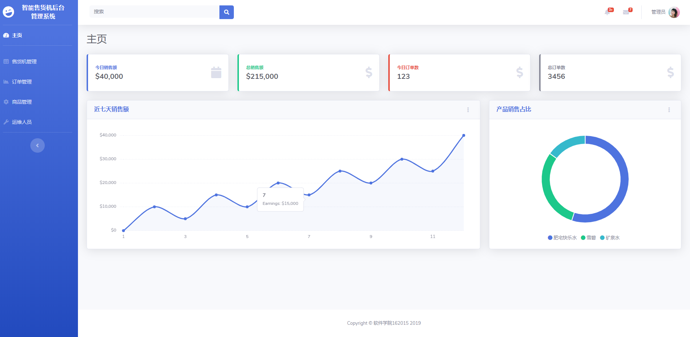
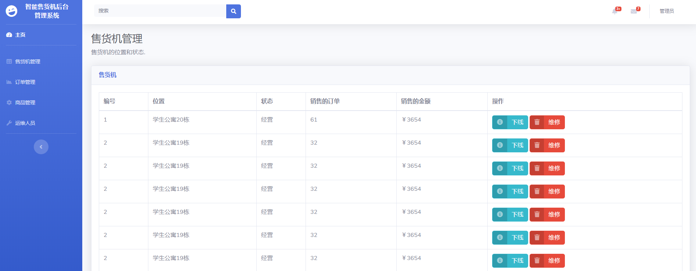
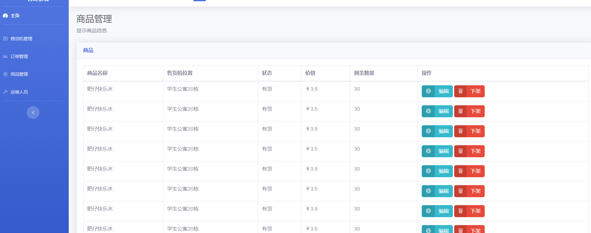
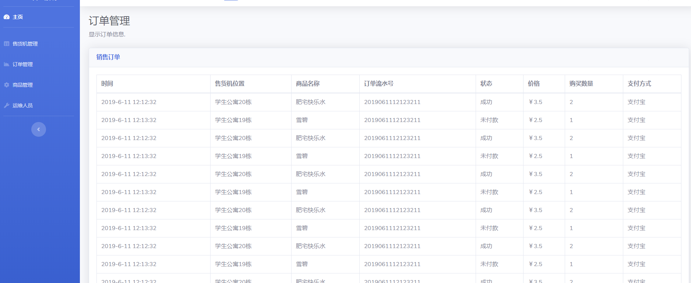
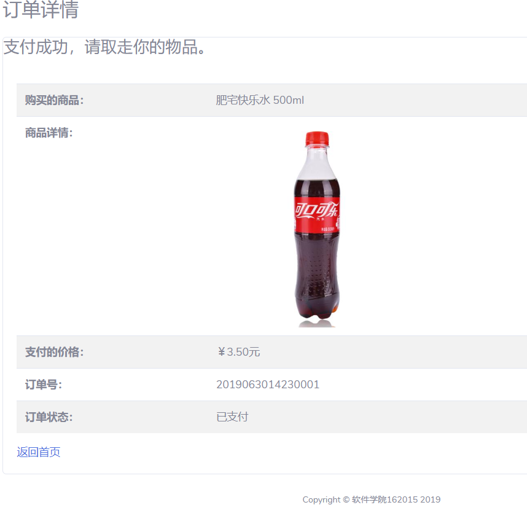

# 系统分析
## 1.1 需求概述
### 1.1.1 项目背景
自动售货机在日常生活中已经屡见不鲜，随处即是的它们方便了人们的生活，节约了人们宝贵的时间。随着人们物质生活水平的提高，自动售货机应该呈现出不同的类别，适用于不同的环境。自动售货机作为一种新型的便民设备,正逐渐被消费者接受。近年来,人们逐渐意识到售货机系统的不完善：对于实时运行状态不能及时了解，也不能及时进行补货操作，影响了机器的正常运行，为运营商和消费者都带来很大不便。为此有人提出了将售货机进行联网的想法，通过网络传输速度快的特点，达到对自动售货机进行快速补货、故障排除的目的。还可以对销售情况进行及时反馈。使顾客操作更方便，使运营商收益最大化。目前我国市场上已经逐步推广自助售货机，其商业前景十分可观。
### 1.1.2 需求说明
本小组开发的智能售货机管理系统很好地将售货机、售货机厂商、运维人员、业务人员结合起来。此系统不是简单的售货机系统，它更多的是针对服务售货机运营商的一个终端系统。在有业务需求时它可以由业务人员通知售货机厂商，售货机厂商负责售货机的安装、维修、运输。运维人员负责每日的巡查工作，包括售货机故障巡查，货物巡查。在发现售货机由故障时运维人员可以通知厂商对售货机进行维修，在缺货情况下运维人员可以通知业务人员及时采购商品进行补货。对于智能售货机，不仅要求其具备简单的收款，找钱和交货功能，还要求在售货机缺货情况下需要对顾客有相应的缺货提示以及机器发生故障时要有报障提示以方便顾客和运维人员。
### 1.1.3 业务规则
系统业务规则如下：
-	顾客能够在智能售货机上购买商品
-	顾客可以选择现金支付、电子支付
-	智能售货机能够实现现金辨识以及找零
-	智能售货机有缺货以及报障提醒
-	业务人员可以实现售货机商品采购
-	业务人员可以提出采购售货机需求
-	售货机厂商可以接收到业务人员的需求，进行售货机的安装、维修、运输
-	运维人员能够巡查售货机，在巡查到售货机发出缺货通知时可以及时补货
-	运维人员巡查到售货机报障时可以通知售货机厂商及时维修
# 系统截图

